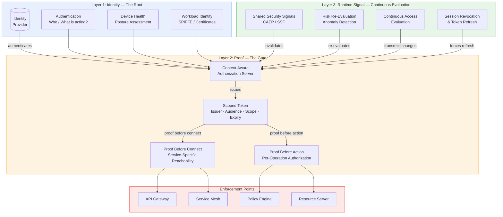

# 19. Identity Is the Root. Proof Is the Gate.

> **Learning Objectives**
> - Distinguish between identity as foundation and proof as enforceable artifact in zero-trust architecture
> - Evaluate the three-layer model — identity root, proof gate, runtime signals — and its relationship to the Octagon axioms
> - Apply the proof-before-connect and proof-before-action patterns to architectural design decisions
> - Understand how AI agents and non-human workloads challenge scoped-proof enforcement
> - Identify the operational requirements for a proof-issuance architecture at scale

**Prerequisites:** [Chapter 1: The Case for Zero Trust](../01-foundations/01-the-case-for-zero-trust.md), [Chapter 2: The Octagon](../01-foundations/02-the-octagon.md), [Chapter 5: Dimensions Deep-Dive D1-D9](../02-methodology/05-dimensions-trust-to-attestation.md)

---

## The Identity-First Foundation

Traditional networks reason about addresses. The questions they ask are topological: where does this traffic come from? Which port and protocol does it use? Zero Trust replaces topology with identity. The better questions are: who or what is acting? Is this identity trusted? Is this device healthy? Is this workload allowed? Is this action allowed right now?

Shifting from *"IP A may reach IP B"* to *"Identity X may access Service Y"* is the paradigm improvement that **Axiom 1 (No Intrinsic Trust)** [↗] demands. Identity-first is the right direction.

But there is a critical nuance that the Octagon's **D2 (Identity Assurance)** [↗] dimension encodes: identity-first should not mean *expose full identity everywhere*. It should mean *use identity to produce verifiable, scoped, short-lived proof*. The **Zero Standing Privileges** [↗] pattern — where access is JIT-minted, time-bounded, and scope-bounded — is the operational expression of this principle.

**Prerequisites for this section:** The dimensions that feed the proof layer are D1 (Trust Anchor) — establishing the cryptographic root — and D2 (Identity Assurance) — determining how identity is minted and scoped. D1 at **Silicon Root of Trust** [↗] and D2 at **Probationary Identity** [↗] provide the strongest foundation for proof issuance.

---

## Identity Should Not Become Traffic Metadata

A naive execution of identity-first would inject raw identity into every packet: usernames in traffic, permanent labels, globally visible metadata, stable tracking identifiers, identity headers that can be copied, vendor-specific formats leaking context into systems that do not need it.

That creates new problems:

- **Tracking and profiling** — stable identifiers enable correlation across enforcement points and over time
- **Privacy erosion** — identity metadata becomes a surveillance surface, potentially creating GDPR-liable artifacts
- **Metadata leakage** — vendor-specific identity formats expose internal architecture to external systems
- **Spoofing and unclear trust semantics** — copied identity headers carry no issuer signature, no audience binding, no expiry
- **New attack surfaces** — every system that receives identity metadata becomes a target for identity forgery

Most enforcement points do not need to know *everything* about the subject. They need to answer a single question: *is this communication allowed?*

That is where proof becomes essential. This maps directly to **Axiom 5 (Deterministic Bounded Authority)** [↗]: every grant of access must confer a mathematically bounded vector of permitted state transitions. The proof token is the bounded vector — it says *what* is permitted, not *who* is requesting.

---

## Existing Standards Already Show the Pattern

OAuth 2.0 and OpenID Connect already give us the mental model. They do not say *"trust this user because the user says so."* Instead:

1. An identity is authenticated
2. A trusted authority evaluates the request
3. A token is issued — with an issuer, audience, scope, and expiry
4. The receiving system validates the token

That token is not raw identity. It is a **proof object** [↗] — a verifiable assertion that *this subject was authenticated by this issuer and granted this permission for this audience for this time window* [TR-§3].

The analogy:

| Concept | Analog |
|----------|--------|
| Identity | Passport — says who you are |
| Proof | Boarding pass — says what you are allowed to do next |

A passport proves identity. A boarding pass proves authorization for a specific flight, at a specific time, through a specific gate. Identity is the root; proof is the gate.

**Important limitation:** OAuth 2.0 and OIDC are not sufficient as-is. Bearer token theft, refresh token replay, confused deputy attacks, and client secret leakage are well-documented weaknesses in the current OAuth ecosystem. The proof model described here extends the pattern with **sender-constrained tokens** [↗] (cryptographically bound to the presenter, such as via **DPoP** or mTLS), **audience-restricted** validation, and **continuous re-evaluation** — addressing gaps that OAuth alone does not close.

This maps to **Axiom 2 (Verifiable Policy)** [↗]: policy is a deterministic state machine. A proof token is a deterministic artifact — same claims, same issuer, same validation rules, same verdict.

---

## The Three-Layer Model

Putting it together, the architecture operates across three layers:

> **Identity is the root. Proof is the gate. Runtime signals decide whether the gate stays open.**

The three layers work together:

1. **Identity** (Layer 1) provides the foundational answer to *who* or *what* is acting. This corresponds to the Octagon's D1 (Trust Anchor) and D2 (Identity Assurance) dimensions. The identity layer must include not just authentication but also device health, posture assessment, and workload identity — the full set of inputs that **Axiom 4 (Continuous Verification)** [↗] requires.

2. **Proof** (Layer 2) converts identity and context into verifiable, scoped, short-lived tokens that enforcement points can validate without seeing raw identity. This corresponds to D3 (Enforcement) and D5 (Violation Response) — the proof layer is where **Axiom 3 (Unbypassable Mediation)** [↗] and **Axiom 5 (Deterministic Bounded Authority)** [↗] are operationalized.

3. **Runtime signals** (Layer 3) keep the system honest — they detect when reality has diverged from the snapshot and trigger re-evaluation. This corresponds to D4 (Behavioral Attestation), D6 (Runtime Enforcement), and D7 (Observability). The runtime layer operationalizes **Axiom 7 (Epistemic Integrity)** [↗] by ensuring that every signal carries cryptographic provenance.

**Critical architectural note:** The diagram shows runtime signals feeding back into the proof layer, not directly into enforcement. This is deliberate. Runtime signals that bypass the proof layer and talk directly to enforcement points create a **split-brain** condition: the proof layer says allow, a runtime signal says deny, and the enforcement point must choose arbitrarily. All runtime-to-enforcement signaling must route through the proof layer to maintain a single, consistent authorization decision point. This is the operational expression of **Axiom 2 (Verifiable Policy)** [↗] — there must be exactly one deterministic evaluation function producing the verdict.

No single layer is sufficient alone. The Octagon's **Axiom 6 (Byzantine Fault Tolerance)** [↗] applies at the inter-layer boundary: the architecture must maintain integrity even when an individual layer fails. A compromised identity provider must not produce valid proofs. A failed proof issuer must not default to allow. Delayed runtime signals must not create indefinite access.

---

## Proof Before Connect

The old network model operated on *connect first, control later.* A better model is *prove first, connect only if allowed.*

Systems like OpenZiti demonstrate this pattern: the question shifts from *can this IP reach that IP?* to *may this identity reach this service?* This is fundamentally different from a VPN mindset. A VPN grants network reachability; a **proof-before-connect** [↗] model grants service-specific reachability.

This maps to the Octagon's **D3 (Enforcement)** dimension at its highest maturity values. When D3 is configured at **Service Mesh** or higher, every connection requires a proof token before the TCP handshake completes. The enforcement point validates the token before any application data flows.

**Operational requirement:** Proof-before-connect requires the proof issuer to be reachable and responsive for every new connection. At scale, this introduces a latency budget: token issuance + validation time must fit within the connection-establishment window. Caching of recently-issued tokens with bounded staleness, pre-issued token pools for high-throughput services, and geographically distributed proof issuers are necessary operational patterns — not optional optimizations.

---

## Proof Before Action

Proof before connect answers *may this identity reach this service?* Modern systems need a sharper question: *may this identity perform **this action**, in **this context**, **right now**?*

Reaching a payroll application does not mean the user may export salary data, approve payments, or change bank details. Reaching an internal API does not mean the workload may call every method, access every dataset, or continue when its risk profile changes.

The next step is not only proof before connect — it is **proof before action** [↗]. This extends **Axiom 5 (Deterministic Bounded Authority)** [↗] to the operation level. Every sensitive operation requires a valid, scoped proof token. The scope is the operation — not the service.

**Operational requirement:** Proof-before-action at scale introduces per-request latency that must be managed. Not every read of a static resource requires a fresh proof token. The architecture should distinguish between:

- **Cached-verdict operations:** Stateless reads, publicly-scoped data, low-sensitivity queries — proof validation can be cached at the enforcement point with a short TTL
- **Fresh-verdict operations:** State-changing writes, sensitive data access, privilege escalation, cross-boundary calls — each requires a proof token issued within a freshness window

This graduated approach prevents the proof issuer from becoming a latency bottleneck while ensuring that the highest-sensitivity operations always carry current authorization.

---

## Proof Issuance Reduces Runtime Fragmentation

Runtime fragmentation is a real problem in multi-platform zero-trust deployments: one tool detects elevated risk, another tool still allows access, a third tool only sees an IP address. These disconnected decisions create gaps that attackers exploit.

This fragmentation becomes manageable when proof issuance itself is **context-aware** [↗]. An authorization server evaluates:

- Identity validity (D1 + D2)
- Device health and posture (D4)
- Risk level from runtime signals (D6 + D7)
- Service and scope appropriateness (D3)
- Token lifetime and constraints

Only then is a proof token issued. Enforcement points no longer need to independently evaluate all these dimensions — they verify the proof and enforce based on it. Runtime context shapes the proof, and the proof shapes enforcement across platforms:

- A low-risk session receives broader scopes
- A high-risk session receives limited scopes
- An unhealthy device receives no proof at all
- A sensitive action requires a stronger proof with shorter lifetime

**Cross-domain trust:** This model works within a single trust domain. In multi-cloud, multi-organization deployments, enforcement point E in system A must trust a proof issued by authorization server P in system B. This requires either a federated trust model (mutually trusted root of trust, such as a shared PKI or SPIFFE federation) or proof notarization by a mutually-trusted third party. Without explicit trust establishment, proofs from different domains must be treated as untrusted input — the same rule that **Axiom 7 (Epistemic Integrity)** [↗] applies to all external data.

---

## Runtime Needs More Than a Token

A token is a snapshot of trust at issuance time. If context changes afterward — device health degrades, risk spikes, session is revoked — the architecture needs a mechanism to react.

A strong architecture needs both token issuance and **continuous access evaluation (CAE)** [↗] to update trust when reality changes. The mechanisms include:

- **Short-lived tokens** — tokens with TTLs measured in minutes, not hours. The shorter the token, the faster the system reacts to context change, but the higher the issuance load
- **Refresh with re-evaluation** — token refresh is not a silent extension. Each refresh triggers a full re-evaluation of identity, device health, risk, and scope appropriateness
- **Sender-constrained tokens** [↗] — tokens cryptographically bound to the presenter via DPoP or mTLS, preventing token replay and theft
- **Session revocation** — push-based revocation signals that propagate to enforcement points in sub-second time
- **Shared security signals** [↗] — protocols like the Shared Signals Framework (SSF) and Continuous Access Evaluation Protocol (CAEP) that allow identity providers, device management platforms, and threat detection systems to broadcast security events

**Draft-standards caveat:** CAEP and SSF are IETF drafts as of 2026 and are not yet widely deployed in production. Architectures being designed today should abstract the signal transport layer so that the mechanism can be upgraded as these standards mature — but should not treat them as available infrastructure.

This maps to the Octagon's **D6 (Runtime Enforcement)** dimension at its higher values. When D6 is configured at **Continuous** rather than **Periodic**, every token refresh, every context change, and every security signal triggers a re-evaluation of every active session. This is architecturally expensive but necessary for high-assurance environments (Archetype A).

---

## AI Agents and the Urgency of Scoped Proof

AI agents amplify the proof-before-action requirement. An agent does not simply open one application — it acts across multiple systems, triggering chains of actions. The question shifts from *who logged in?* to *is this action chain still allowed?*

An agent may start with a valid task, but context can shift mid-execution: the risk profile changes, data becomes unexpectedly sensitive, the next action falls outside the original purpose. Broad access is dangerous. An agent should receive narrow permission:

- For this task
- For this scope
- For this time window
- Under this context

That is where proof-based enforcement becomes decisive — not full identity everywhere, but scoped proof: short-lived, verifiable, revocable, context-aware.

**Architectural challenges unique to AI agents:**

1. **Pre-scoping impossibility:** Non-deterministic agents cannot be pre-scoped to a finite task description. The architecture must support proof elevation — an agent requests broader scope mid-task, and the elevation triggers re-authentication, re-evaluation, and an audit record of the scope change
2. **Sub-agent chains:** When an agent spawns a sub-agent, the sub-agent inherits a scoped-down proof token with a parent-chain audit trail. The parent token must carry a delegable flag. Sub-agents without proof tokens are untrusted — they either operate in a sandbox or are blocked
3. **Audit completeness:** Every proof issuance and verification event in an agent action chain must produce a signed audit record. Chain integrity requires linked proof IDs — without them, forensic reconstruction of what an agent did and whether each action was authorized is impossible

These requirements extend **Axiom 5 (Deterministic Bounded Authority)** [↗] into the agent domain. An agent's authority is not just bounded — it is **linked** across actions, forming a verifiable chain of authorization decisions.

---

## What Traffic Should Say

The future of Zero Trust is not about embedding identity into every packet. It is not about checking identity once before connection and calling it done.

It is about turning identity, context, and policy into short-lived proofs that enforcement points can verify — before connection, before sensitive actions, and again when context changes.

The interesting architectural question is:

> How do we connect identity, policy intent, runtime signals, and enforcement proof — without exposing identity everywhere and without creating a central bottleneck?

This question is not fully answered by any current architecture, including the model described here. It defines the frontier. The elements are known — hardware-attested identity, scoped proof tokens, continuous runtime evaluation, shared security signals — but the integration of these elements at scale, across trust domains, and under latency budgets remains active engineering work.

The direction, however, is clear. Traffic should not say: *This is who I am.* It should say: *Here is proof that I am allowed to do exactly this.*

---

## Migration Path from Current Architectures

Most organizations today operate with OAuth 2.0, mTLS, VPNs, identity-aware proxies, and perimeter firewalls. The three-layer model is not a forklift replacement — it is an incremental migration target.

**Phase 1: Layer the proof gate over existing identity (3-6 months).** Deploy a context-aware authorization server that consumes your existing identity provider. Begin issuing scoped, short-lived tokens instead of long-lived OAuth tokens. Enforcement points begin validating proof tokens for new connections. Existing connections continue on current tokens until expiry.

**Phase 2: Add runtime signal integration (6-12 months).** Connect device health, threat detection, and anomaly detection platforms to the proof issuer via a signal bus. Tokens begin carrying risk-contextualized scopes. Short-lived tokens become the default. Token refresh requires re-evaluation.

**Phase 3: Federate across trust domains (12-24 months).** Establish cross-domain trust for proof validation. Deploy proof notarization for multi-cloud enforcement. SaaS platforms begin consuming proof tokens through standard APIs (as regulatory and standards pressure makes this viable).

This phased approach acknowledges that full implementation of the three-layer model is a 2-3 year journey for most organizations, aligning with the Octagon's maturity progression from D-level through B-level configurations.

---

## Key Takeaways

1. **Identity is the root; proof is the gate.** Identity-first does not mean exposing identity everywhere. It means using identity to produce scoped, verifiable, short-lived proof tokens that enforcement points can validate without seeing raw identity
2. **The three-layer model maps to the Octagon dimensions:** Layer 1 (Identity) ↔ D1/D2, Layer 2 (Proof) ↔ D3/D5, Layer 3 (Runtime) ↔ D4/D6/D7. The architecture is only as strong as its weakest layer
3. **Proof-before-connect replaces VPN-style network reachability with service-specific authorization.** Proof-before-action extends this to per-operation scoping for sensitive operations. Both require operational patterns — token caching, pre-issuance pools, distributed issuers — to function at scale
4. **Proof issuance reduces runtime fragmentation** by concentrating context evaluation in the authorization server. Enforcement points validate the proof, not the raw context. Cross-domain trust must be explicitly established before proofs from external domains are trusted
5. **AI agents make scoped proof urgent.** Agents that act across systems with broad access are a structural vulnerability. Sub-agent chaining, proof elevation, and linked audit trails are the minimum requirements for agent-authorization architectures
6. **This is an active frontier, not a solved problem.** The integration of hardware-attested identity, scoped proof tokens, continuous runtime evaluation, and shared security signals — at scale, across domains, under latency budgets — remains active engineering work. The direction is clear. The implementation is not yet commoditized

---

## Cross-References

**Builds on:** [Chapter 1: The Case for Zero Trust](../01-foundations/01-the-case-for-zero-trust.md), [Chapter 2: The Octagon](../01-foundations/02-the-octagon.md), [Chapter 5: Dimensions Deep-Dive D1-D9](../02-methodology/05-dimensions-trust-to-attestation.md)
**Related:** [Chapter 3: Octagon as Validation Instrument](../01-foundations/03-octagon-as-instrument.md), [Chapter 6: Dimensions D6-D9](../02-methodology/06-dimensions-response-to-human.md), [Chapter 7: Meta-Patterns](../02-methodology/07-meta-patterns.md), [Chapter 8-12: Archetypes A-D](../03-archetypes/)
